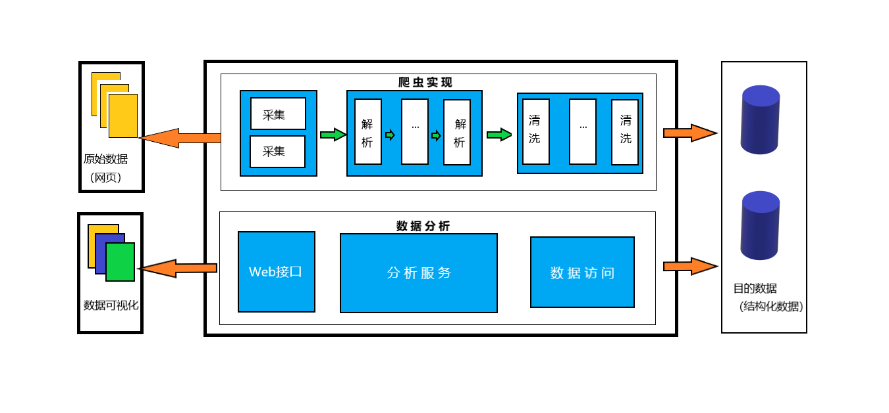

##唐诗分析程序
###1.简介
   唐诗分析程序主要是通过抓取互联网上的唐诗，然后进行数据的清洗，存储，数据分析，输出报告
###2.背景  
    随着Java的发展，提供了流式处理数据（Stream）的能力，数据分析也是近年来比较热门的技术职业发展方向。通过初步学习，研究简单的数据采集
    清洗，存储和分析，了解整个数据分析的基本流程。
###3.意义
* 了解数据分析的基本流程
* 熟悉数据分析方法
* 了解唐诗的奥秘
###4.目标数据
数据采集主要来自：https://www.gushiwen.org/gushi/tangshi.aspx
###5.功能
* 数据采集，清洗，存储
* 数据分析，数据可视化展示
###6.技术
* Stream流式处理（jdk8的特性）
* 文本分词和解析（ansj）
* 多线程
* 网页解析工具（htmlunit)
* 数据库和JDBC编程
* 数据可视化（HTML/CSS/JavaScript，echarts，jQuery）
* Servlet/Sparkjava嵌入式Web容器（自己写web服务器）
* DIY构建对象管理工程
###7.实现

